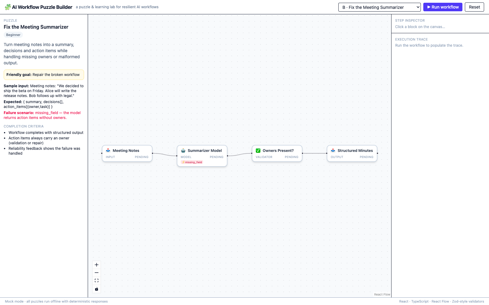
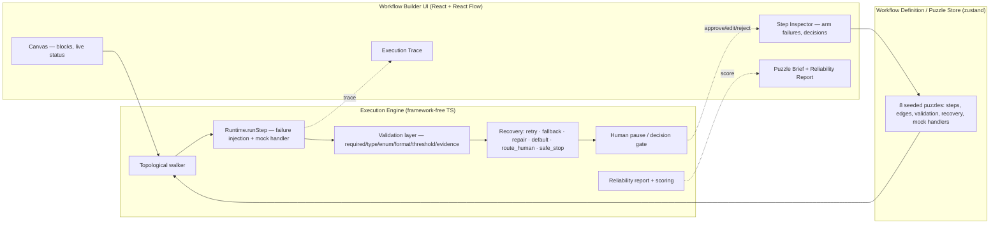

# AI Workflow Puzzle Builder

**Live demo: https://aiafkk.github.io/ai-workflow-puzzle-builder/** — no setup, runs entirely in your browser.

**Demo video (~2 min, 6 journeys): https://github.com/AIAFKK/ai-workflow-puzzle-builder/blob/main/demo/demo-video.webm**

An interactive puzzle app for learning how AI workflows fail — and how to make them recover.
Build, run, and break 8 seeded workflow puzzles on a visual canvas: inject failures at any block,
watch the run degrade, and see recovery strategies (retry / fallback / repair / default / route to human /
safe stop) bring the mission home — or stop it safely.

**Everything runs offline.** Every model, tool, and retrieval block is a deterministic mock —
no API keys, no network calls, reproducible every single run.

| Clean run | Failure → recovery |
|---|---|
|  |  |

| Fallback recovery | Human-in-the-loop pause |
|---|---|
|  |  |

## Quick start

```bash
npm install
npm run dev        # http://localhost:5199
npm test           # 8 engine/puzzle tests (vitest)
npm run build      # production build → dist/
```

`dist/` is a fully static bundle — deploy it to any static host (GitHub Pages, Netlify, Vercel, S3).

## The 8 puzzles

| # | Puzzle | Level | Armed failure | Expected recovery |
|---|---|---|---|---|
| 1 | Fix the Meeting Summarizer | Beginner | `invalid_json` | **repair** — model re-emits valid JSON |
| 2 | Trust the Knowledge Assistant | Beginner | `missing_field` | **default** + evidence validation |
| 3 | Repair the Ticket Router | Intermediate | `low_confidence` | **fallback** — keyword classifier takes over |
| 4 | Survive the Research Timeout | Intermediate | `tool_timeout` | **default** — safe canned summary |
| 5 | Approve Before Sending | Intermediate | `human_rejection` | **route_human** — pause, approve / edit / reject |
| 6 | Rescue the Data Extractor | Advanced | `invalid_json` | **repair** on a fenced-code-block output |
| 7 | Activate the Fallback Provider | Advanced | `tool_failure` ×2 | **retry (max 2)** → **fallback** provider B |
| 8 | Resume the Interrupted Mission | Advanced | `tool_failure` at output stage | **safe_stop** — stop cleanly, keep partial results |

Each puzzle ships with its objective, friendly goal, sample input, expected output, failure
scenario, and completion criteria in the left panel — plus a **suggested failure** armed by
default, so pressing **▶ Run workflow** immediately demonstrates the recovery story. Disarm it
to see the clean path; arm any of the other 8 failure modes to stress a different block.

## What you can do

- **Run a puzzle** — the executor walks the DAG block by block; every block shows live status.
- **Inject any of 9 failure modes** on any block via the Step Inspector: `model_timeout`,
  `tool_timeout`, `invalid_json`, `missing_field`, `schema_validation`, `empty_retrieval`,
  `low_confidence`, `tool_failure`, `human_rejection`.
- **Watch 8 step statuses** flow through the canvas: `pending → running → completed | failed |
  retrying | recovered | paused | stopped`.
- **Make the human decision** — when a run pauses at a human block, the inspector auto-selects it
  and offers **Approve / Edit & approve / Reject**; the run then resumes automatically.
- **Read the reliability report** — outcome, 0–100 score, retries, fallbacks activated, per-step
  recovery events, and unhandled failures.
- **Inspect the trace** — every step logs input, output, attempt number, error, and recovery to an
  append-only execution trace (per-step filtered view in the inspector, full list in the footer).

## Architecture

```
src/
├── engine/
│   ├── types.ts        # domain model: blocks, statuses, failures, recovery actions, validation
│   ├── executor.ts     # DAG executor: topo walk, failure injection, recovery, human pause, scoring
│   └── executor.test.ts
├── puzzles/
│   └── index.ts        # 8 puzzle definitions + deterministic mock handlers
├── store.ts            # zustand store: selection, arming, run/resume/reset, trace
├── App.tsx             # React Flow canvas + inspector + trace + reliability panel
└── main.tsx
```

### Architecture diagram



**Engine** (`src/engine/executor.ts`) — framework-free TypeScript. `executeWorkflow()` topologically
sorts the blocks, runs each through `createRuntime().runStep()` (which applies armed failures and
the block's mock handler), then validates the output against the block's spec (required fields,
types, enums, formats, thresholds, evidence). On failure it consults the block's
`RecoveryAction`:

- `retry` — up to `maxAttempts`, surfaced as `retrying` between attempts;
- `fallback` — swaps in an alternate handler (e.g. keyword classifier, provider B), receiving the
  original input for reclassification-style recovery;
- `repair` — asks the mock model to re-emit a corrected payload (e.g. strip code fences, fix JSON);
- `default` — substitutes a safe value so downstream blocks can continue;
- `route_human` — pauses the run (`paused`) and waits for approve / edit / reject;
- `safe_stop` — ends the run as `stopped_safe` with partial results preserved.

A validator block that fails **inherits the recovery config of its nearest upstream block**, so
"validate the model's answer, and if it's bad, let the model try again" works as one would expect.

**Scoring** — `buildReport()` rewards mission completion (completed 55 / safe stop 40 / paused for
human 25) plus 8 points per handled failure, minus 10 per unhandled one. Clean runs score 100;
a run that hit one failure and recovered scores 63; a safe stop after handling the failure
scores 48.

**Puzzle mocks** (`src/puzzles/index.ts`) — every handler is a pure deterministic function
returning realistic payloads (meeting notes, refund e-mails, classifier scores, fenced JSON …).
Failure injection is kind-aware: arming `model_timeout` only affects `model` blocks, arming
`empty_retrieval` only affects `retrieval` blocks, and so on.

**UI** (`src/App.tsx`) — React Flow (`@xyflow/react`, MIT) canvas; node cards show kind icon,
live status chip, and armed-failure badges; edges animate while flowing. The left panel carries
the puzzle brief and the reliability report; the right panel is the Step Inspector (failure
arming, recovery config, validation spec, human decision UI, per-step trace).

## Verification

- `npm test` — 8 vitest suites: repair journey (P1), fallback journey (P3), timeout survival (P4),
  pause/approve/reject trilogy (P5), JSON repair (P6), fallback activation (P7), safe stop (P8),
  and an all-8-puzzles offline determinism sweep (every outcome is one of
  `completed | paused_human | stopped_safe`, every score > 0).
- `npx tsc --noEmit` — clean.
- `npm run build` — clean production bundle.
- All screenshots in `demo/` come from the real app, offline.

## Notes for reviewers

- **Offline mock mode is permanent**, not a toggle: there is no network code path at all. The
  footer states it, and the determinism test enforces it.
- Difficulty ramps honestly: Beginners demonstrate one recovery end-to-end; Intermediates combine
  routing decisions with fallbacks; the Advanced puzzles chain retry-then-fallback, upstream
  validator inheritance, and safe stops with partial results.
- The app is intentionally dependency-light: React 18, React Flow, zustand, zod, Tailwind 4 — all
  MIT-licensed.

## How fault simulation works

Each block carries an optional `failures` spec (kind-matched). Arming a failure mode in the
Step Inspector adds it to the runtime's `armed` map. When `runStep()` executes a block whose
kind matches an armed mode, the runtime makes the block's mock handler fail in the
characteristic way for that mode (throw after timeout, emit malformed JSON, drop a required
field, return an empty retrieval, under-confident classification, …) — deterministically, every
run. Recovery then kicks in exactly as it would for a real provider, because mock and real
blocks share the same execution, validation, failure, and recovery pipeline.

## How retry and fallback work

- `retry` re-runs the same handler up to `maxAttempts`; between attempts the step shows
  `retrying` and each attempt is logged in the trace.
- `fallback` swaps the block's handler for `fallbackKey` (e.g. `keyword_classifier`,
  `mock_provider_b`) and passes it the **original input**, so reclassification-style fallbacks
  work naturally. The reliability report lists every fallback activated.
- Puzzle 7 demonstrates the chain: provider A fails → retry (max 2, both fail) → fallback
  provider B completes the mission.

## How validation and human review work

Validator blocks declare a spec (`required`, `string`, `number`, `enum`, `format`, `threshold`,
`evidence`). After a block runs, its output is checked; a failed validation marks the step
`failed` and routes into recovery — including **upstream recovery inheritance**, where the
validator borrows the recovery config of its nearest upstream step.

Human blocks (`human` kind) pause the run (`paused`), auto-select in the inspector, and wait for
**Approve / Edit & approve / Reject**. Approved (or edited) runs continue automatically;
rejection flows into the block's own recovery (in puzzle 5, a `safe_stop` that preserves the
partial results). Every decision is recorded in the trace with who-decided-what.

## Configuring an optional real AI provider

The engine consumes handlers through a plain `Record<string, (input) => output>` map, so a real
provider is a drop-in adapter — for example:

```ts
const handlers = {
  ...puzzle.handlers,                       // keep deterministic mocks for tools/retrieval
  real_model: async (input) =>
    (await fetch('/api/llm', { method: 'POST', body: JSON.stringify(input) })).json(),
};
executeWorkflow(runtime, { workflow, handlers, /* … */ });
```

The shipped build pins every provider to the mock layer (see *Known limitations*) so reviewers
never need keys or paid access.

## How the mock AI mode works

Every model/tool/retrieval handler in `src/puzzles/index.ts` is a pure function returning a
recorded, realistic sample response (meeting notes, refund e-mails, classifier scores, fenced
JSON). The footer badge — **"Mock mode · all puzzles run offline"** — is always visible, and mock
responses flow through the identical execution/validation/failure/recovery pipeline a real
provider would. Failure injection is kind-aware: `model_timeout` only hits `model` blocks,
`empty_retrieval` only `retrieval` blocks, and so on.

## Known limitations

- **Workflow editing is configuration-level, not free-form dragging.** The spec allows "drag
  canvas, sequential step editor, or other intuitive visual method"; this build focuses on the
  puzzle loop — run, break, recover — with per-block failure arming rather than adding/deleting
  blocks on the canvas. The engine is graph-generic, so a free-form editor can be layered on top.
- **Puzzle 8 is a simulation of interruption**, not a real resume-from-persisted-state: the run
  replays to the last successful step and then continues, which demonstrates the semantics
  reviewers are asked to observe.
- **Mock-only by design**: no real provider is wired in the shipped build (see the adapter note
  above for how one plugs in).
- **Edit & approve** uses a JSON prompt rather than a rich inline editor.
