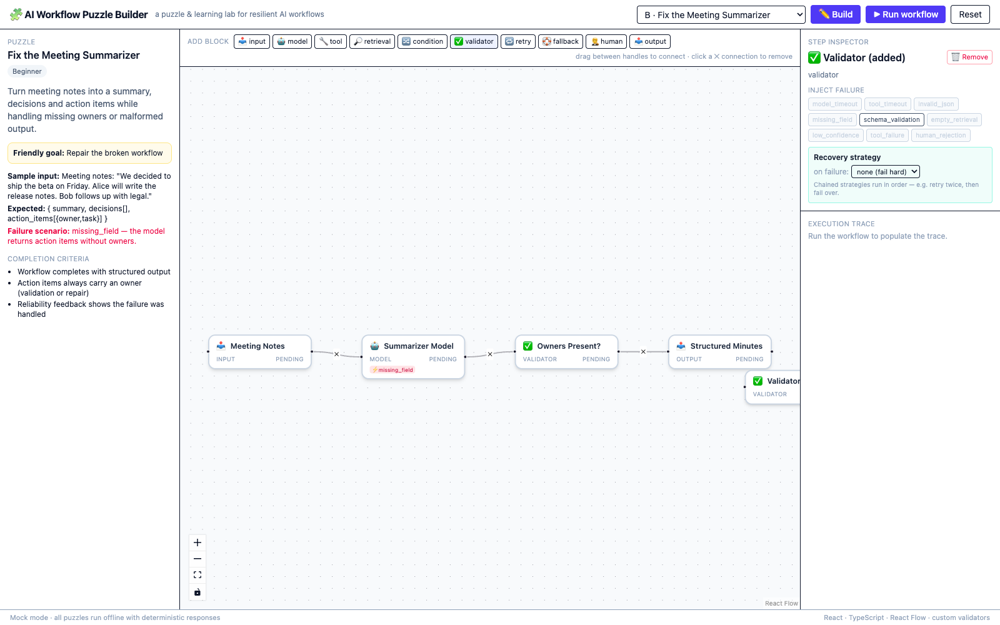
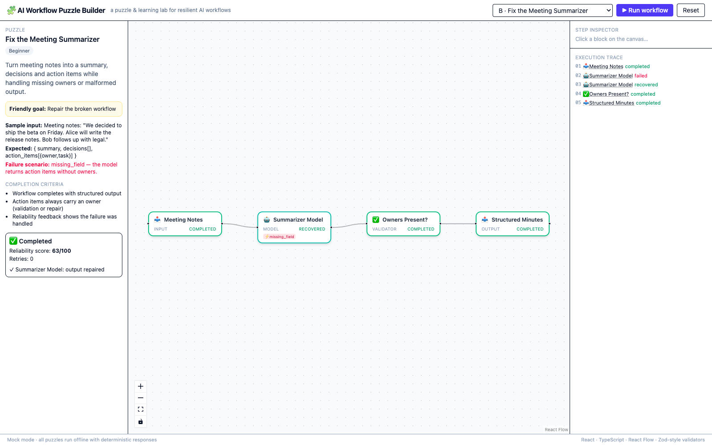
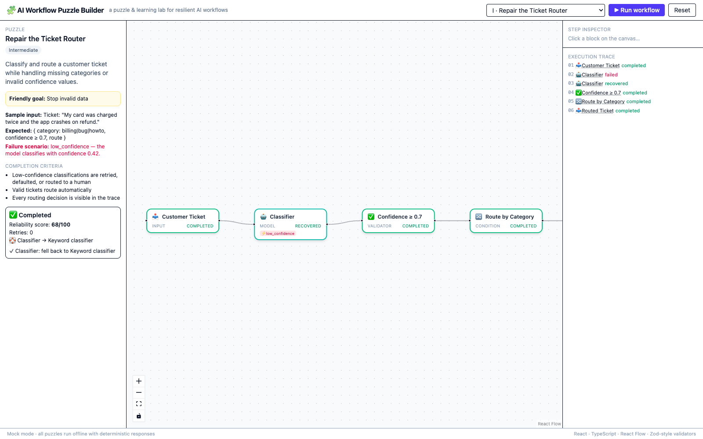
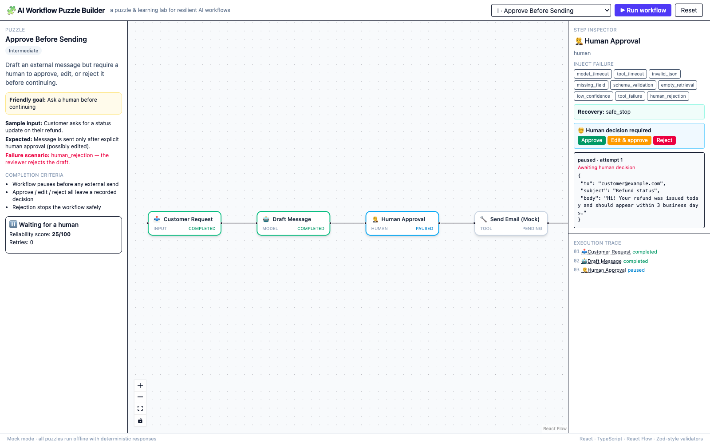
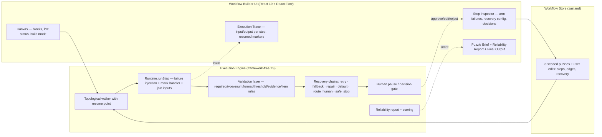

# AI Workflow Puzzle Builder

**Live demo: https://aiafkk.github.io/ai-workflow-puzzle-builder/** — no setup, runs entirely in your browser.

**Demo video (~2.5 min, 7 journeys incl. build mode, retries and resume): https://github.com/AIAFKK/ai-workflow-puzzle-builder/blob/main/demo/demo-video.webm**

An interactive puzzle app for learning how AI workflows fail — and how to make them recover.
Pick a seeded puzzle, run it, break it with failure injection, then **build**: add blocks, wire
them together, configure recovery strategies, and re-run to see how your design holds up.

**Everything runs offline.** Every model, tool, and retrieval block is a deterministic mock —
no API keys, no network calls, reproducible every single run.

| Build mode: add & wire blocks | Failure → recovery |
|---|---|
|  |  |

| Fallback recovery | Human-in-the-loop pause |
|---|---|
|  |  |

## Quick start

```bash
npm install
npm run dev        # http://localhost:5199
npm test           # 12 vitest tests (engine + puzzles)
npm run build      # production build → dist/
```

`dist/` is a fully static bundle — deploy it to any static host (GitHub Pages, Netlify, Vercel, S3).

## The 8 puzzles

| # | Puzzle | Level | Default-armed failure | Recovery you will see |
|---|---|---|---|---|
| 1 | Fix the Meeting Summarizer | Beginner | `missing_field` on model | **repair** — model re-emits valid output; validator checks every action item has an owner |
| 2 | Ground the Knowledge Assistant | Beginner | `empty_retrieval` on lookup | **safe default** — assistant refuses to answer without evidence |
| 3 | Repair the Ticket Router | Intermediate | `low_confidence` on classifier | **fallback** — keyword classifier takes over |
| 4 | Survive the Research Timeout | Intermediate | `tool_timeout` on source B | **safe default** — synthesis uses source A and flags the skipped one (both sources join) |
| 5 | Approve Before Sending | Intermediate | — (human gate by design) | **human approval** — pause, then approve / edit & approve / reject |
| 6 | Validate the Data Extractor | Advanced | `invalid_json` on model | **repair** — fenced-code-block output stripped to a valid object |
| 7 | Activate the Fallback | Advanced | `model_timeout` on primary | **retry ×2 (visible in trace) → fallback** to mock provider B |
| 8 | Resume the Interrupted Mission | Advanced | built-in interruption | **safe_stop → ▶ Resume** continues from the last successful step |

Each puzzle ships with its objective, friendly goal, sample input, expected output, failure
scenario, and completion criteria in the left panel — plus a **suggested failure armed by
default**, so pressing **▶ Run workflow** immediately demonstrates the recovery story.
Disarm it to see the clean path (a pristine run scores 100/100); arm any other failure mode
to stress a different block.

## What you can do

- **Run a puzzle** — the executor walks the DAG block by block; every block shows live status.
- **Build / modify the workflow** — toggle **✏️ Build** to add any of the 10 block types
  (input, model, tool, retrieval, condition, validator, retry, fallback, human, output),
  drag blocks to arrange them, drag between handles to connect (cycles are rejected), click a
  ✕ connection to remove it, and delete added blocks. Added blocks run through the exact same
  execution / validation / failure / recovery pipeline as the seeded ones.
- **Configure recovery** — the Step Inspector lets you set each block's strategy: `retry`
  (with a max-attempts knob), `fallback`, `repair`, `default`, `route_human` or `safe_stop` —
  and chain *retry → then → fallback* like puzzle 7.
- **Inject any of 9 failure modes** on any block: `model_timeout`, `tool_timeout`,
  `invalid_json`, `missing_field`, `schema_validation`, `empty_retrieval`, `low_confidence`,
  `tool_failure`, `human_rejection`. Injection is kind-aware — arming `model_timeout` only
  fires on model/tool blocks, `empty_retrieval` only on retrieval blocks (the inspector
  greys out modes that cannot fire on the selected block kind).
- **Watch 8 step statuses** flow through the canvas: `pending → running → completed | failed |
  retrying | recovered | paused | stopped`.
- **Make the human decision** — when a run pauses at a human block, the inspector auto-selects
  it and offers **Approve / Edit & approve / Reject**; Edit opens an in-page JSON editor with
  validation, and the run resumes automatically.
- **Resume an interrupted mission** — after a safe stop, the report offers
  **▶ Resume from last successful step**; the resumed segment is marked ↻ in the trace.
- **Read the reliability report** — outcome, 0–100 score, retries, fallbacks activated,
  per-step recovery events, unhandled failures, and the final output.
- **Inspect the trace** — every step logs **input**, output, attempt number, error, and
  recovery to an append-only execution trace (per-step filtered view in the inspector).

## Architecture

```
src/
├── engine/
│   ├── types.ts        # domain model: blocks, statuses, failures, recovery chains, validation
│   ├── executor.ts     # DAG executor: topo walk, failure injection, recovery chains, joins,
│   │                   #   human pause, resume, reliability scoring
│   └── executor.test.ts
├── puzzles/
│   └── index.ts        # 8 puzzle definitions + deterministic mock handlers
│                       #   + GENERIC_HANDLERS for user-added blocks
├── store.ts            # zustand store: selection, arming, run/resume/reset, build-mode editing
├── App.tsx             # React Flow canvas + inspector + trace + reliability panel
└── main.tsx
```

### Architecture diagram



**Engine** (`src/engine/executor.ts`) — framework-free TypeScript. `executeWorkflow()`
topologically sorts the blocks and runs each through `createRuntime().runStepSync()`:

1. **Failure injection** — armed modes that match the block's kind short-circuit it with the
   characteristic error for that mode, deterministically.
2. **Handler** — the block's mock handler runs with the step's input. A step with several
   upstream edges (a join) receives `{ joined: [{step, output}, …] }` instead of a single
   payload — puzzle 4's synthesizer merges both sources this way.
3. **Validation** — validator/human/condition blocks check their spec (`required`, `string`,
   `number`, `enum`, `format`, `threshold`, `evidence`, `nonEmptyItems`).
4. **Recovery** — on failure the block's **recovery chain** runs in order:
   - `retry` — re-executes the block (through the same runtime, so injections still apply)
     until the max-attempts budget is spent, surfacing `retrying` between attempts;
   - `fallback` — swaps in an alternate handler, fed the original input;
   - `repair` — asks the mock model to re-emit a corrected payload;
   - `default` — substitutes a safe value so downstream blocks can continue;
   - `route_human` — pauses the run and waits for approve / edit / reject;
   - `safe_stop` — ends the run as `stopped_safe` with partial results preserved.

   A validator that fails **inherits the recovery chain of its nearest upstream block**.
5. **Resume** — `resumeFromStepId` restarts the walk at a chosen step seeded with the last
   good output; entries carry a `resumed` marker (puzzle 8's ▶ Resume button).

**Scoring** — a pristine completion is **100**. Completing after handled failures keeps you
close (80 + 8/handled); a safe stop preserves half plus recovery credit; unhandled failures
cost 10 each. Waiting for a human is scored as partial progress by design.

**Puzzle mocks** (`src/puzzles/index.ts`) — every handler is a pure deterministic function
returning realistic payloads (meeting notes, refund e-mails, classifier scores, fenced JSON…).
User-added blocks bind to `GENERIC_HANDLERS` and flow through the identical pipeline.
Puzzle 8's hotel provider crashes on its first execution and returns on the second — a
simulated interruption that makes Resume meaningful.

**UI** (`src/App.tsx`) — React Flow canvas; node cards show kind icon, live status chip, and
armed-failure badges; build mode adds the block palette, connection editing and the recovery
configurator. The left panel carries the puzzle brief and the reliability report; the right
panel is the Step Inspector.

## Verification

- `npm test` — 12 vitest tests: pristine 100 + repair (P1), evidence refusal (P2), fallback
  (P3), two-source join + skipped-source flag (P4), pause/approve/**edited**/reject (P5),
  JSON repair (P6), **retry ×2 visible then fallback** (P7), **interrupt → safe stop → resume
  to completion** (P8), an all-8 offline determinism sweep, a build-mode journey (user
  inserts a validator, workflow still completes), parallel branches never crossing
  streams, and route_human truly pausing until approved.
- `npx tsc --noEmit` — clean.
- `npm run build` — clean production bundle.
- All screenshots in `demo/` come from the real app, offline.

## How fault simulation works

Each block can have failure modes **armed** from the Step Inspector (puzzles come with a
suggested one pre-armed). Arming adds the mode to the runtime's armed map; when `runStepSync()`
executes a block whose kind matches an armed mode, the runtime makes the block fail in the
characteristic way for that mode — deterministically, every run. Recovery then responds exactly
as it would for a real provider, because mock and real blocks share one execution pipeline.

## How validation and human review work

Validator blocks declare a spec (`required`, types, `enum`, `format`, `threshold`, `evidence`,
and `nonEmptyItems` — "every item in `action_items` must carry a non-empty `owner`"). A failed
validation marks the step `failed` and routes into recovery, including **upstream recovery
inheritance**. Human blocks pause the run, auto-select in the inspector, and wait for a
decision; **Edit & approve** opens an in-page JSON editor (parse-checked) and the edited payload
flows onward; rejection triggers the block's own recovery (in puzzle 5, a safe stop). Every
decision is recorded in the trace.

## Configuring an optional real AI provider

The engine consumes handlers through a plain `Record<string, (input, ctx) => output>` map, so a
real provider is a drop-in adapter:

```ts
const handlers = {
  ...GENERIC_HANDLERS, ...puzzle.handlers,    // keep deterministic mocks for tools/retrieval
  real_model: async (input) =>
    (await fetch('/api/llm', { method: 'POST', body: JSON.stringify(input) })).json(),
};
executeWorkflow(runtime, { workflow, handlers, /* … */ });
```

The shipped build pins every provider to the mock layer (see *Known limitations*) so reviewers
never need keys or paid access.

## How the mock AI mode works

Every model/tool/retrieval handler is a pure function returning a recorded, realistic sample
response. The footer badge — **"Mock mode · all puzzles run offline"** — is always visible, and
mock responses flow through the identical execution/validation/failure/recovery pipeline a real
provider would.

## Known limitations

- **Build mode edits block-level structure** (add/remove/connect blocks, configure recovery),
  not the payload schema of seeded puzzle blocks — added blocks bind to generic passthrough
  mocks rather than a per-block payload editor.
- **Decisions persist until Reset** — once you approve/edit/reject a human gate, subsequent
  Runs replay the recorded decision instead of pausing again; press Reset to decide afresh.
- **Mock-only by design**: no real provider is wired in the shipped build (adapter note above).
- **Condition blocks route linearly** — branching renders one path; the branch edge labels in
  the data model are not yet drawn on the canvas.
